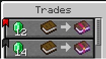
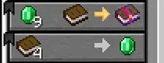
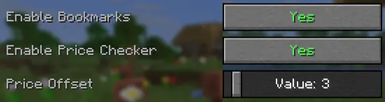

# 📜 Cherished Trades

Cherished Trades adds new features to the villager trading system, allowing you to bookmark villager trades for quick and easy access and see which ones have a good price. This is a lightweight Client-side mod that improves your Minecraft Experience.

---

### Key Features

- Allows you to bookmark villager trades, putting them always on the top

- See if a enchanted book price is the lowest you can get

- Configurable offset for the price

---

### Notes

You are free to add this mod to any modpack you'd like.
